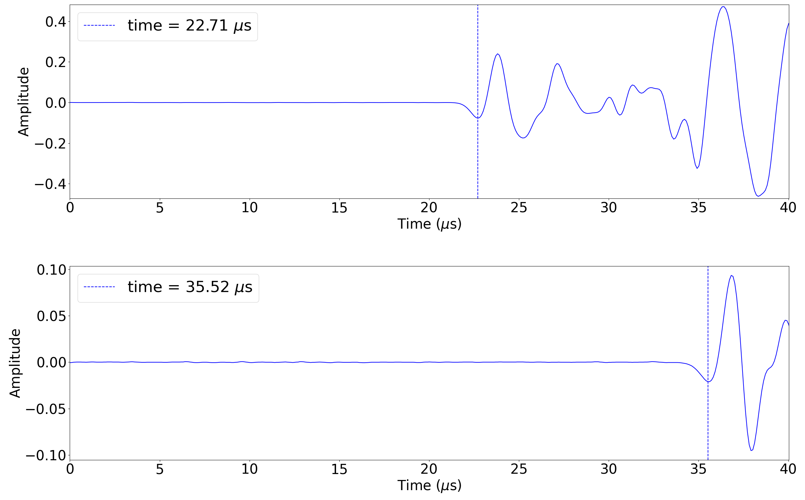
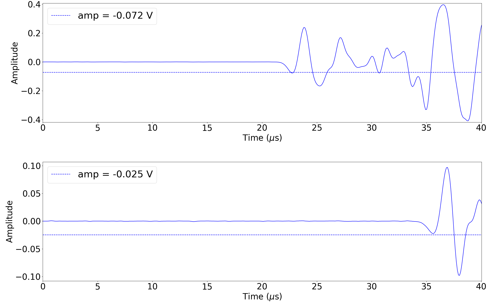

# daly_lab_ae_pipeline

**Nick Tulshibagwale**  
ntulshibagwale@ucsb.edu

**Created:** April 24, 2024  
**Updated for Readability:** August 8, 2026

Tools for processing acoustic emission (AE) data output from Digital Wave `.txt` files.

## Scripts

### 1. `filter_ae.py`

The user selects a Digital Wave `.txt` file containing acoustic emission waveform data. The program loops through each AE event and displays the corresponding waveforms for visual inspection.

The user presses:

- **Enter** to keep the event
- **n** to discard the event as noise

The waveforms are then separated and saved into two JSON datasets:

- `*_filter.json` — retained AE events
- `*_noise.json` — discarded events

### 2. `compute_toa.py`

The user selects a filtered `.json` dataset and loops through the waveforms. For each waveform, the user manually identifies the **Time of Arrival (TOA)** using mouse selection.

#### Time-of-Arrival Selection Example

The figure below shows TOA selection for a two-sensor acoustic emission event. The dashed vertical lines indicate the manually selected arrival time for each sensor.

### 3. `compute_peak_polarity.py`

The user selects a `.json` dataset and loops through the waveforms to identify the **initial peak polarity** using mouse selection.

#### Peak Polarity Selection Example

The figure below shows peak-polarity selection for the same two-sensor acoustic emission event. The dashed horizontal lines indicate the selected initial peak amplitude for each waveform.

### 4. `load_in_process_data.py`

Demonstrates how to load the processed JSON dataset for further analysis.

The processed dataset contains waveform data and associated information:

- Parent experimental file
- Event number
- Sensor number
- Time of arrival
- Peak polarity

